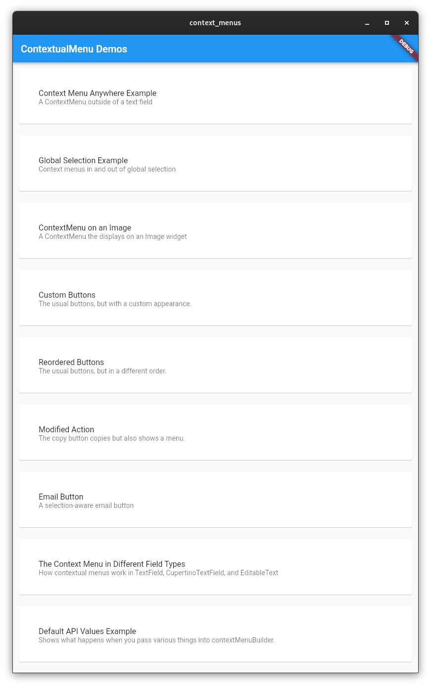
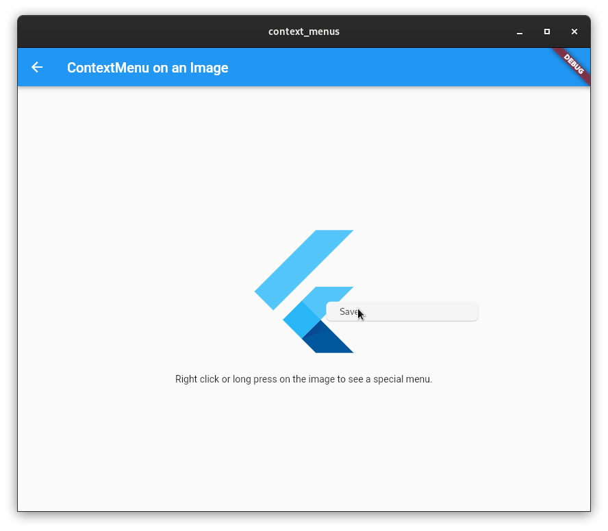

# Context Menu Examples

A list of many examples of building custom context menus in Flutter.

Check out the live demo running on the web, linked above.

## References

 * [PR 107193](https://github.com/flutter/flutter/pull/107193) introduced this feature.
 * [Samples PR 1463](https://github.com/flutter/samples/pull/1463) brought these examples to the [Flutter samples repo](https://github.com/flutter/samples/pull/1463).

## Repository maintenance
To publish to GitHub Pages, do the following:

  1. `git checkout pages`
  1. `git merge main`
  1. `flutter build web`
  1. Edit build/web/index.html and change the `base` `href` to `"/flutter_context_menu_examples/"`.
  1. `cp -r build/web/ docs`
  1. `git commit -am "Update GitHub Pages"`
  1. `git push`
